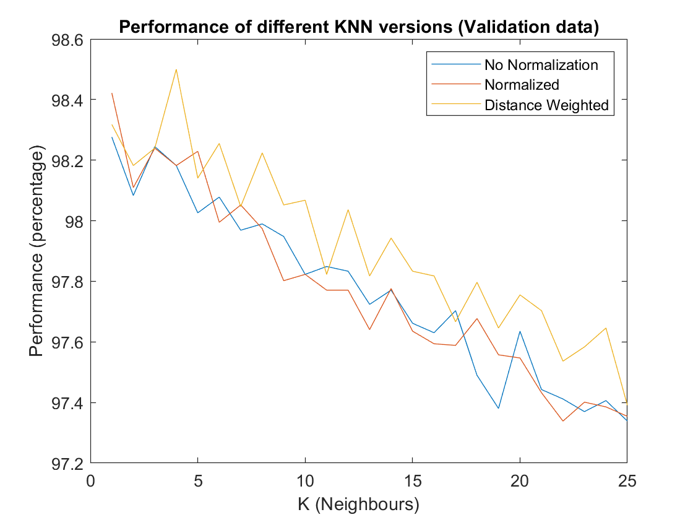

# An Activity Recognition framework on Matlab

In this framework, two supervised learning methods were implemented that would classify different activites, whose data is provided in the [`data.mat`](data.mat) file.

## Description

The detailed description of the task is given in the [`Coursework_Specifications.pdf`](Coursework_Specifications.pdf) file. 

In the data, there are five action classes that needs to be classified. For the classification task, two types of models were created: k-Nearest Neighbor and Naive Bayes. The final results were reported using a k-fold crossvalidation on the given training data. No access was available to the real testing data, which was used on the model after it was submitted. The reported accuracies were found by doing 10-fold crossvalidation on the given training data.

## Results

The overall results of this project are given in the [`CourseworkReport.pdf`](CourseworkReport.pdf). The prediction accuracies and training+testing times are given below (the models were run on an i5-7300U CPU):

| Method | Accuracy | Time |
|:-------|:-------:|:-------:|
| Naive Bayes| 97.15% | 2.3s |
| k-Nearest Neighbor | 98.5% | 69.3s|

No access was available to the real testing data, which was used on the model after it was submitted. The reported accuracies were found by doing crossvalidation on the given training data.

The effect of the 'k' variable for kNN classifier was shown in the figure below:

These results (and results shown in other figures in [`/Figures`](/Figures)) were used to specify model design

## Dependedcies

-Matlab

This project doesnt require any external software or libraries.

## Quick Guide

To run the kNN classifier, run the [`kNN_Master.m`](kNN_Master.m) script on Matlab. Similarly, run [`NB_Master.m`](NB_Master.m) script to run the Naive Bayes classifier. The scripts do training and testing multiple times to account for model variability, you should change the the code if you want it to run just once.
